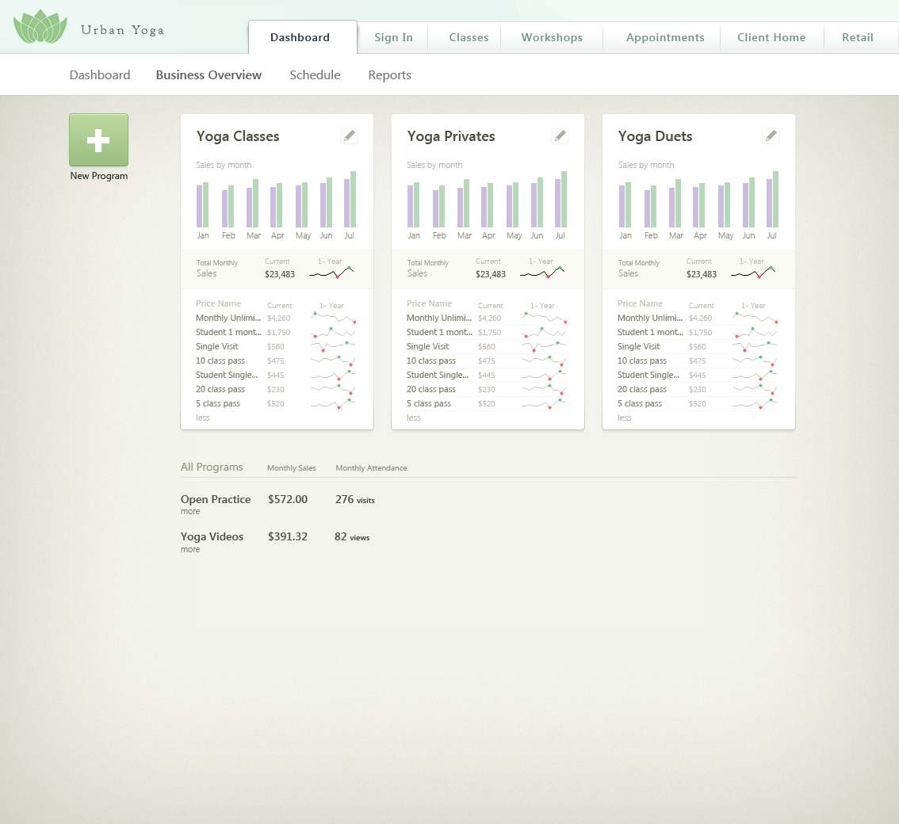

## UI Mockup Example Instruction
1. The page should closely resemble [business_overview.png](business_overview.png) on the page load:
    
    
2. The page should closely resemble [business_overview_expanded.png](business_overview_expanded.png) when the "more" links are clicked:
    
    
3. The pencil icon should change color on hover. You may use the provided pencil image or use a similar icon of your choice.
4. The "New Program" button should respond to hover and click (but it doesn't have to do anything when clicked)
